# CRUD para tabla Clientes y Productos

## Tabla Clientes:

### Listar tabla clientes:
- http://localhost:8080/clientes/listar

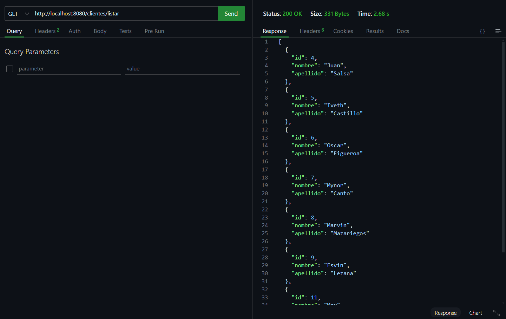

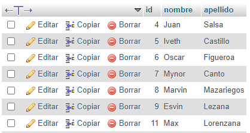

### Guardar un dato en tabla clientes:

- http://localhost:8080/clientes/guardar

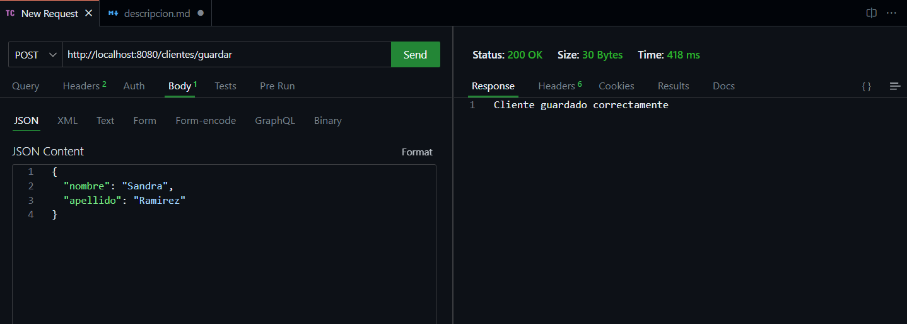

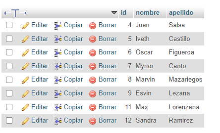

### Eliminar en tabla clientes:

- http://localhost:8080/clientes/eliminar/12

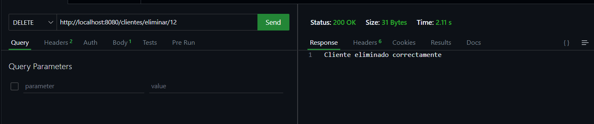

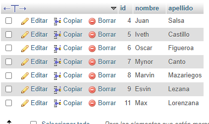

## Tabla Productos:

### Listar tabla productos:

- http://localhost:8080/productos/listar

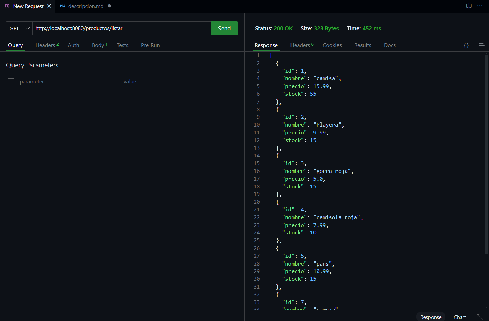

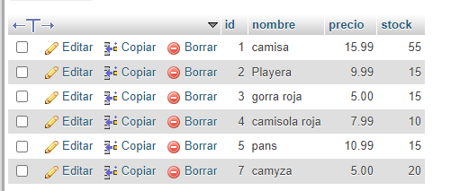

### Guardar un dato en tabla productos:

- http://localhost:8080/productos/guardar

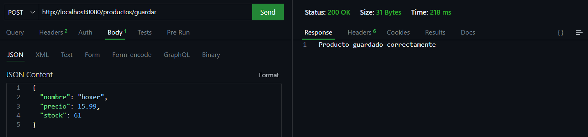

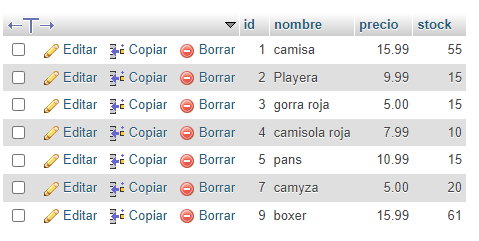

### Eliminar en tabla productos:

- http://localhost:8080/productos/eliminar/9

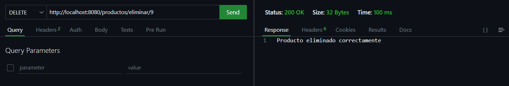

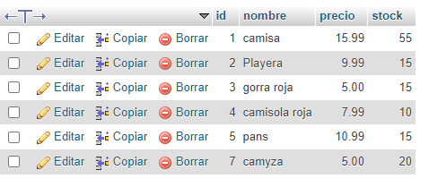